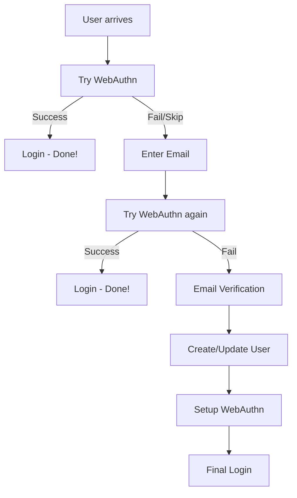

# Authentik Email + Passkey Authentication Flow Implementation Guide (ULTRA-SIMPLIFIED)

This guide walks you through implementing the Email + Passkey authentication flow with maximum simplification while maintaining all functionality.

## Flow Visualization



## Overview

This flow provides a modern authentication experience where users can:

-   Sign in with passkeys (if available) - **IMMEDIATE LOGIN ON SUCCESS**
-   Fall back to email verification for new users or recovery
-   Automatically create accounts in the "peers" group
-   Recover access via email if passkey fails

## Implementation Steps

### 1. Create Groups

#### Peers Group (for all users)

1. Navigate to **Directory** → **Groups**
2. Click **Create**
3. Configure:
    - **Name**: `peers`
    - **Is superuser**: Unchecked
    - **Parent**: Leave empty

### 2. Create Flows

#### Main Authentication Flow

1. Navigate to **Flows & Stages** → **Flows**
2. Click **Create**
3. Configure:
    - **Name**: `hello-universe`
    - **Title**: `Sign in with your email`
    - **Slug**: `hello-universe`
    - **Designation**: `Authentication`
    - **Authentication**: `Require unauthenticated`

### 3. Create Stages

#### Identification Stage (Email Input + User Lookup Combined)

1. Navigate to **Flows & Stages** → **Stages**
2. Click **Create** → **Identification Stage**
3. Configure:
    - **Name**: `identification`
    - **User fields**: Select `Email`
    - **Sources**: Leave empty
    - **Show matched user**: Unchecked
    - **Show source labels**: Unchecked

#### WebAuthn Stage (Authentication & Setup Combined)

1. Click **Create** → **WebAuthn Authenticator Stage**
2. Configure:
    - **Name**: `auth`
    - **Configure flow**: Leave empty
    - **User verification**: `Preferred`
    - **Authenticator attachment**: `Platform`

#### Email Verification Stage

1. Click **Create** → **Email Stage**
2. Configure:
    - **Name**: `verification`
    - **Use global settings**: ✓
    - **Activate user on success**: ✓

#### User Write Stage (Creation & Update Combined)

1. Click **Create** → **User Write Stage**
2. Configure:
    - **Name**: `peer`
    - **Create users as inactive**: Unchecked
    - **User creation mode**: `Create when option is set`
    - **Create users group**: Select `peers`

#### Login Stage

1. Click **Create** → **User Login Stage**
2. Configure:
    - **Name**: `one`

### 4. Create Policies (Minimal Set)

#### User Exists Policy

1. Navigate to **Policies** → **Policies**
2. Click **Create** → **Expression Policy**
3. Configure:
    - **Name**: `known`
    - **Expression**:
    ```python
    return bool(request.context.get('pending_user'))
    ```

#### Authentication Success Policy

1. Click **Create** → **Expression Policy**
2. Configure:
    - **Name**: `success`
    - **Expression**:
    ```python
    # Check if user is authenticated (simplified)
    return bool(request.user and request.user.is_authenticated)
    ```

### 5. Configure Flow Stage Bindings (ULTRA-SIMPLIFIED)

#### Main Authentication Flow

Navigate to **Flows & Stages** → **Flows** → Select `hello-universe` → **Stage Bindings** tab

**Add the following bindings in the EXACT order below:**

1. **Order 10**: WebAuthn (Try First)

    - **Stage**: `auth`
    - **Policy engine mode**: `All`
    - **Invalid response action**: `Continue`
    - **No policies** (let WebAuthn handle availability)

2. **Order 15**: Login (After Initial Success)

    - **Stage**: `one`
    - **Policy engine mode**: `All`
    - **Policies**: `success`

3. **Order 20**: Email Input + User Identification (Combined)

    - **Stage**: `identification`
    - **No policies** (always shown if WebAuthn didn't work)

4. **Order 30**: WebAuthn (Identified Users)

    - **Stage**: `auth`
    - **Policy engine mode**: `All`
    - **Invalid response action**: `Continue`
    - **Policies**: `known`

5. **Order 35**: Login (After User Success)

    - **Stage**: `one`
    - **Policy engine mode**: `All`
    - **Policies**: `known`, `success`

6. **Order 40**: Email Verification (All Cases)

    - **Stage**: `verification`

7. **Order 50**: User Creation/Update

    - **Stage**: `peer`

8. **Order 60**: WebAuthn Setup

    - **Stage**: `auth`

9. **Order 90**: Final Login
    - **Stage**: `one`

### 6. Configure Application

1. Navigate to **Applications** → **Applications**
2. Select your application or create a new one
3. Set **Authentication flow** to `hello-universe`

## Key Simplifications Made

### **Reduced Components:**

-   **1 WebAuthn stage** (handles both auth & setup)
-   **1 User Write stage** (handles both creation & update)
-   **1 Identification stage** (handles email input + user lookup)
-   **2 policies total** (only what's needed)
-   **9 stage bindings** (streamlined flow)
-   **No separate email prompt or email input stages**
-   **No separate setup flow**

### **Simplified Flow Logic:**

1. **Try WebAuthn first** → Login if successful
2. **Email input/identification** (single stage) → Try WebAuthn again → Login if successful
3. **Email verification** → Create/update user → Setup WebAuthn → Login

### **User Experience:**

#### **Scenario 1: Returning User with Passkey**

1. WebAuthn prompt appears immediately
2. **IMMEDIATE LOGIN** - no email prompt

#### **Scenario 2: User Needs Email Entry**

1. Email input/identification (single step) → WebAuthn prompt
2. **IMMEDIATE LOGIN** if successful

#### **Scenario 3: New User or Recovery**

1. Email input/identification → Email verification → Account setup → WebAuthn setup → Login

## Benefits of Ultra-Simplification

-   **Minimal components** to manage and maintain
-   **Cleaner configuration** with less room for error
-   **Same functionality** as complex version
-   **Easier troubleshooting** with streamlined flow
-   **Automatic group assignment** to peers for all users
-   **Immediate login** on successful authentication
-   **Only 2 policies** - minimal complexity
-   **Single email input stage** handles both collection and identification

## Component Summary

### **Total Components:**

-   **1 Group** (`peers`)
-   **1 Flow** (`hello-universe`)
-   **5 Stages** (`identification`, `auth`, `verification`, `peer`, `one`)
-   **2 Policies** (`known`, `success`)
-   **9 Stage Bindings**

## Testing the Simplified Flow

1. **Test with existing user**: Should see WebAuthn prompt → immediate login
2. **Test with new user**: Should see email input → verification → setup → login
3. **Test recovery**: Email input → verification → setup → login

This ultra-simplified version maintains all the original functionality while being much easier to implement and maintain with the absolute minimum components required!
